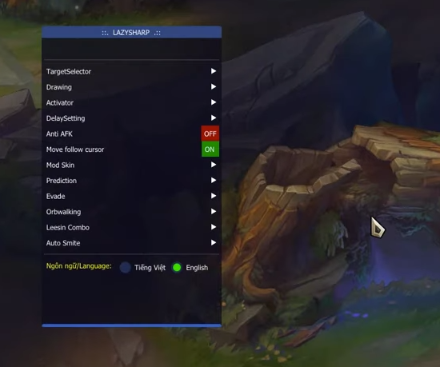

# SCREEN PVLOL [10.12 UPDATE]

Core Control : http://dl.seotop.org/PVLOL_QTE/Core1.json

Riot Server DLL : http://dl.seotop.org/PVLOL_QTE/PVLOL104.DAT

Garena Server DLL : http://dl.seotop.org/PVLOL_QTE/PVLOL103.DAT

# PVLOL Hook Inject [10.12]
How it works: Hook inject. [When the hook takes the point, if the dll sees that point, it will be injected and run] If the pointer does not get the desired value, the dll will not be inject.

# How to find a hook pointer?
85 F6 74 0F 8D ?? ?? ?? ?? sigma engine with find
This is an offset value. Copy pointer.
Paste it into the writepointerinteger array in the Pvlol_succes section.
Put the dll you want to be next to the exe program.

# We broke the Eazfuscator protection and read inside.
The method of injecting the software in the MemoryHackers platform with the hook method is shown.
LazySharp - General dependencies
This is free distributed software. We do not accept legal responsibility. It is shared only for learning and software development purposes.

My Contact: sanghoontargaryen@yandex.com